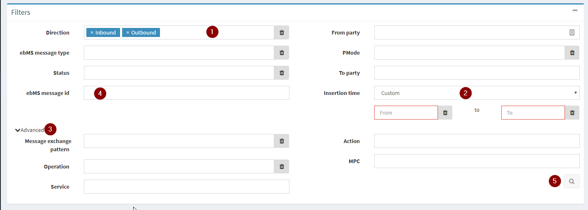
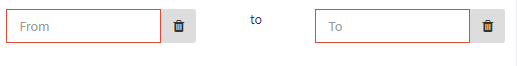
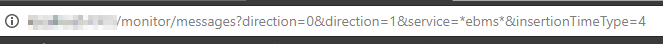
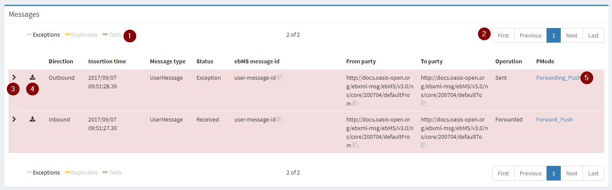

# Monitor

The monitor section makes it possible to show all the messages in the runtime.

## Filters

1. Filter on specific direction(s), this is an OR filter. In the above example, all inbound & outbound messages will be shown.

2. Insertion time filter has some pre-defined time filters: Last hour, Last 4 hours, Last day, Last week, Last month & custom. The custom filter will let you input a from & to datetime. Only one of the 2 inputs are mandatory. This this means if you for ex want to get all messages until a certain datetime, then you only have to set a value in the “to” input.

    

3. Advanced filters are “hidden” under this section. By default this section is hidden.

4. Text inputs like “ebMS message id”, “From party” & “Action” support the * wildcard. If you for ex want to search for all messages containing “ebMS” in the action field then you can enter “*ebms*” in the action filter.

5. Do a search for all the messages matching the filter criteria. After searching the url will be updated, containing the filters you entered. This makes it possible to bookmark your search or share it with others.

    

## Results

When a search is executed then all matching messages will appear in the “Messages” box.

1.  Legend of the colored rows in the grid. When a message has status exception then the whole row will be colored red. Duplicates will be shown in yellow & Test messages will have a gray color.
By default, the duplicates & test messages aren’t shown in the results. You can click on the text value in the legend to show these messages in the results.

2. Paging, makes it possible to navigate to other pages or you can use the quick buttons like “first” to jump to the first page.

3. This button will expand the detail view of the message, showing you the following UI.

    

    **Related messages**: contains messages which are related to the expanded message.
    **Info**: Contains extra info of the message like “Exchange pattern”, “Operation”, “Service”, “Action” & “MPC”.
    **Exceptions**: Show a list of exception messages related to the expanded message.

4. Download the message body.
5. Jump to the PMode definition used in the message. If the PMode used in the message is different from the definition a dialog will be shown informing you that there is a difference.