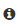
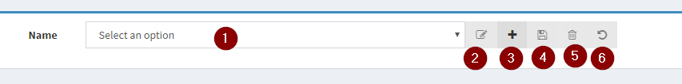

# Portal

## Setup

A setup guide will be shown when you start the portal for the first time.

- Enter & password for the “admin” & “readonly” user and a key for the JWT signing. After this press “send” and changes will be saved
    - You can generate a random JWT key by pressing 
- After saving the changes you will get the following screen and you will be able to login with your admin or readonly users password.

## Portal Settings

It’s also possible to make changes to the appsettings.json using the portal.

- Open the “Portal settings” under the “Settings” menu.

    

- The following UI will appear

    

For an explanation of each of these settings we refer to the “1.5 Appsettings.json” section.

> Note: Changes made to the appsettings.json, from the portal or appsettings.json will be in effect after you refresh your browser!

## Runtime Settings

As with the portal settings, it’s also possible to make changes to the settings.xml used by the runtime itself.

> Note: When saving one of these changes a dialog telling you that the changes will only be in effect after restarting the runtime will appear.

- Open the “Runtime settings” under the “Settings” menu.

    

- The following screen will appear.

    

### Save Settings

- When changes to a setting section is done then the   icon will light up.
- Press the  icon to save the requested changes.

## Default UI functionality

### Info Tooltip

To give you some extra context info some of the fields have a  after them. If you hover this icon then a tooltip will appear to give you some extra info about the field, ex:

### CRUD Input

Many of the screens in the Portal use a CRUD (Create, Read, Update, Delete) control which looks like the following.

1. Select an existing type. When there are no unsaved changes then the existing type will be selected immediately. If there are unsaved changes then a dialog notifying you of unsaved changes will ask your confirmation to continue without saving.

    

2. Rename an existing type, will only be enabled when something is selected. A dialog will appear, asking you to enter a new name. After pressing “OK” the item will be renamed, but not yet saved!

    

3. Create a new type. A dialog asking you to enter a new name and selecting an existing type as a base template will be shown.

    

    > Note: The clone is an existing type from which the data will be copied from into your new type, afterwards you can make any changes you want. The list also contains the type “empty” if you prefer to start from an empty type.

4. Save the changes. When there are any unsaved changes, then this button will light up.
5. Delete existing item. This button will light up when an existing item has been selected. Before the item is delete, a dialog to ask your confirmation will appear.
    
    

6. Revert to previous state. When you have made changes to the type, then this button will light up. If you press it then the all the values will be reverted to the last saved state.

### Invalid Input

- Controls will get a red border when the input is invalid or when a value is required. For example

    

- The PMode input screens are tab based, to inform you it contains an invalid input the tab will get a red line.

    

### Copy to clipboard

When you see the  icon then you can copy the contents on the left side of the icon to the clipboard by clicking on it. When successful a tooltip with “Copied to clipboard” will appear.
