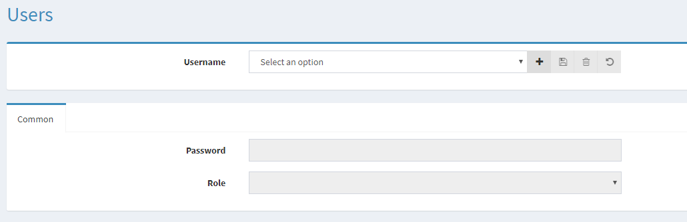

# User Management

By default, the portal uses ASP.NET identity provider for authentication and a database for storage.
To manage users, open the “users” menu from the navigation menu.

The following UI will be shown:

## Roles

The Portal supports 2 types of user roles:

- **Admin**: This gives a user full access to the portal.
- **Readonly**: Readonly access to the portal, which means he can only view settings, but not change them. Searching for message using the monitor is still possible.

## Change Password

The user UI won’t show the user password, so it’s impossible to retrieve an existing password. The only option is the set a new password.

- Select an existing user from the “Username” dropdown.

    

- Enter a new password in the “Password” field. The password must meet the following complexity:

    - At least one digit
    - At least one special character
    - At least one lower case character
    - At least one none numeric character
    - At least one uppercase character
    - Minimum length is 6 characters

    