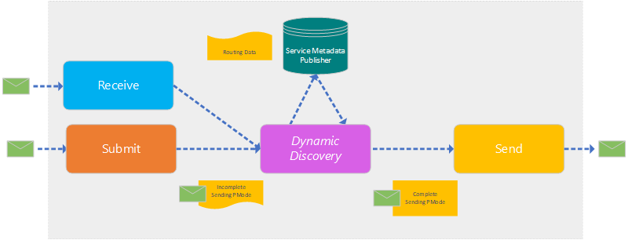

# Dynamic Discovery

## What is _Dynamic Discovery_

Dynamic Discovery allows you to define _Sending Processing Modes_ that do not contain all the specific routing information.  
The _Sending Processing Mode_ that is used to send an AS4 Message is dynamically decorated with the required routing information by the AS4 MSH during the send operation.

Dynamic Discovery makes it possible to have fewer _Sending Processing Modes_:  
Instead of having full blown _Sending Processing Modes_, Dynamic Discovery allows you to have fewer 'incomplete' _Sending Processing Modes_ that act as a template. The missing routing information will be dynamically added by the AS4.NET MessageHandler when an AS4 Message is being sent.
When appropriate, using _Dynamic Discovery_ can save you time since there are fewer _Sending Processing Modes_ to maintain.

## How does _Dynamic Discovery_ work

When _Dynamic Discovery_ is enabled in the _Sending Processing Mode_, AS4.NET will attempt to decorate the _Sending Processing Mode_ with routing information that is retrieved from an SMP server (\_Service Metadata Publisher).

The _Sending Processing Mode_ defines the _SMP Profile_ that must be used to retrieve the routing information. If there's no _SMP Profile_ specified, AS4.NET will use a default profile where AS4.NET itself will act as an SMP server.
In this case, AS4.NET will retrieve routing information from its own routing table and will complete the _Sending Processing Mode_ with this information.
**Any routing information that is already defined in the _Sending Processing Mode_ will be overwritten during this operation!**

In AS4.NET, _Dynamic Discovery_ is supported in both receive/forward/send scenario's and in regular submit/send scenario's:

## How to configure _Dynamic Discovery_

### Define the SMP Profile in the _Sending Processing Mode_

To enable _Dynamic Discovery_, a _Sending Processing Mode_ must have a `DynamicDiscovery`element.

In this `DynamicDiscovery`element, the `SMP Profile` that must be used can be specified.
The value that is configured in this element, refers to a class that implements the `IDynamicDiscoveryProfile` interface.
If no `SMP Profile` is defined, AS4.NET will fall back to a default implementation that uses the routing rules that can be defined in AS4.NET.

## Incomplete _Sending Processing Mode_

To correctly sent or forward a message, we need to know some required routing information.
Normally, all this information is present in the _Sending Processing Mode_ but when using _Dynamic Discovery_, this information can be ommitted from the Sending PMode.

When making use of _dynamic discovery_, the following items can be ommitted from the _Sending Processing Mode_:

- **Push Configuration**
  - Url to where to message must be sent to
  - Whether or not the message must be send using TLS
- **Encryption**
  - Public Key Certificate that must be used to encrypt the message
  - Encryption algorithm information
- **Message Packaging**
  - To Party (Role and Party Id)
  - Collaboration Info (Service and Action)

AS4.NET will retrieve this information using an SMP and decorate the PMode with the information that has been received.
The routing information that has been received has priority over any existing routing information that might already be present in the _Sending Processing Mode_.

## Specify routing information in AS4.NET

The routing information that will be added to the _Sending Processing Mode_ will be retrieved by the AS4.NET MSH from a _Service Metadata Publisher_ server. By default, AS4.NET will act as the SMP server if dynamic forwarding is enabled.

The routing information is to be configured via the Web Portal of the <b>AS4.NET</b> component:

- In de sidebar click on the menu item **SMP Configuration**
  - This will show a list of all the configured configurations available for _Dynamic Forwarding_
- To add a new configuration, click the "+" button
  - This will show a dialog
- When finished with the typing of the routing info of your _Sending Processing Mode_, click the button "**OK**"
  - Your configuration is now available during the _Dynamic Forwarding_

TODO: show dialog detail view of the SMP Configuration

> The SMP Configuration needs at least an _Url_ and _ToParty_ _Id_, _Role_, and _Type_

## Retrieve Routing Info During Sending or Forwarding

AS4.NET will query the SMP profile (default or custom) to retrieve the routing information that must be used to complete the _Sending Processing Mode_.

This information will be retrieved based on the **ToParty** information; this means that AS4.NET must know the identifier of the ToParty to determine the routing information.

- During _Sending_, the routing information is retrieved from either the _SubmitMessage_ or the _Sending Processing Mode_. The _SubmitMessage_'s **ToParty** is used when the _Sending Processing Mode_ has set the `AllowOverride` to `true`; otherwise the **ToParty** from the PMode is used.
  > Note that the _Dynamic Discovery_ will fail if the _Sending Processing Mode_ has set the `AllowOverride` to `false` and the _SubmitMessage_ contains a **ToParty** that's different from the _Sending Processing Mode_ **ToParty**.
- During _Forwarding_, the routing information is retrieved from the _AS4 Message_ itself
