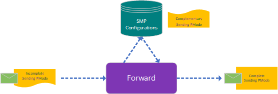

# Dynamic Forwarding (a.k.a. Dynamic Discovery)

## What is _Dynamic Forwarding_?

Dynamic Forwarding is a "special" way of message forwarding, by which the _Sending Processing Mode_ dynamically gets decorated with required routing information during the forward operation.

This way of forwarding allows us to forward messages with an "incomplete" _Sending Processing Mode_ (without routing information). This _Processing Mode_ will be made "complete" during the forwarding by using either the configured _SMP Configurations_ (meta data, TODO: what's the full description of "SMP"?) stored in the datastore of the <b>AS4.NET</b> component or by requesting a _SMP Profile_ via a custom implementation.

This way of forwarding allows you to reuse certain _Sending Processing Modes_ and will therefore result in lesser _Processing Modes_ to maintain.

> Following image show the message flow with an "incomplete" _Sending Processing Mode_ attached, and will be made complete by the local configured _SMP Configurations_ resulting in a message with a complete _Sending Processing Mode_.

## Incomplete _Sending Processing Mode_

What makes the _Sending Processing Mode_ "incomplete"?

To correctly forward a message (and therefore send out the message), we need to know some required routing information. All this routing info can be moved from your _Sending Processing Mode_ to a _SMP Configuration_ entry. This will result in that the _Sending Processing Mode_ is now "incomplete" due to the missing routing info.

This routing information consists of:

- **Push Configuration**
  - Url to where to send the message to
  - Whether or not the message must be send through TLS
- **Encryption**
  - Public Key Certificate
  - Key Transport Algorithms
- **Message Packaging**
  - To Party (Role and Party Id)
  - Collaboration Info (Service and Action)

> This routing information is simuliar to the information specified in the _Sending Processing Modes_. So, for more information about this routing info see the page about the _Sending Processing Mode_.

> Any routing information defined in the _Sending Processing Mode_ will be overwritten during the forward operation!

## Move Routing Info to Local SMP Configuration

Local _SMP Configurations_ are configured via the Frontend of the <b>AS4.NET</b> component:

- In de sidebar click on the menu item **SMP Configuration**
  - This will show a list of all the configured configurations available for _Dynamic Forwarding_
- To add a new configuration, click the "+" button
  - This will show a dialog
- When finished with the typing of the routing info of your _Sending Processing Mode_, click the button "**OK**"
  - Your configuration is now available during the _Dynamic Forwarding_

TODO: show dialog detail view of the SMP Configuration

> The SMP Configuration needs at least an _Url_ and _ToParty_ _Id_, _Role_, and _Type_

## Retrieve Routing Info During Forwarding

To make a decision which _Sending Processing Mode_ to use during the forward operation, either the local or custom implementation will first retrieve the _SMP Profile_ via the **ToParty**.

With this profile, the same implementation (local or custom) will decorate the _Sending Processing Mode_ so it is complete and therefore ready to be used for sending.
