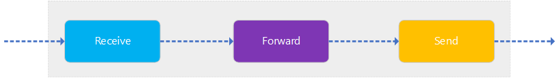
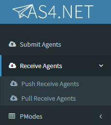
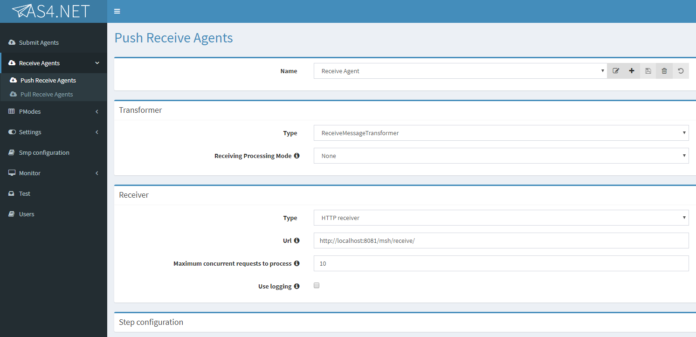
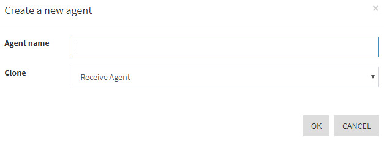
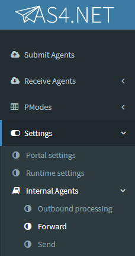

# Setting Up Intermediary MSH (i-MSH)

The **AS4.NET** component can be configured as an intermediary MSH (i-MSH). This means that the component is not the final recipient of the message, and therefore has to forward the message to the next MSH.

The following section will explain how to configure an **AS4.NET** MSH as an i-MSH.

## Required Agents for Intermediary MSH

To be able to act as an i-MSH, AS4.NET requires the following agents to be correctly configured:

- **Receive Agent**
- **Forward Agent**
- **Send Agent**



The agents can be configured via the Frontend of the component:

### Add a Receive Agent

- In the sidebar, click on the **Receive Agents** menu

  - This will expand a sub-menu with **Push** and **Pull Receive Agents**.
  - An i-MSH configuration doesn't require a specific **Receive** configuration so you're free to choose which one, depending on your requirements.
    

  - Both **Push** and **Pull Agents** will show the same kind of view to add agents
    

- To add an **Agent**, click the "+" button

  - This will show a dialog to either create a new agent or clone from an existing agent:
    
  - Afterwards, click on the **OK** button and the **Save** button (button with floppy disk icon) the agent is configured on the **AS4.NET** component.

### Add Forward and Send Agent

The **Forward** and **Send Agents** are both _Internal_ agents, so they can be found in the sub-menu **Internal Agents** in the **Settings** menu.

The same flow as described for the **Receive Agent** is applivcable for the **Forward** and **Send Agent**.

It also doesn't matter which kind of **Send Agent** you configure. **AS4.NET** supports MEP bridging which means that it is perfectly possible to receive AS4 Messages via pulling and forward them via a **Push Send Agent** or vice versa; receive pushed AS4 Messages and forward them via pulling.

> When creating a new agent, the default _Steps_ are automatically assigned to the Agent; only a _Receiver_ is needed when creating an _Agent_.

> Newly created agents will only be part of the **AS4.NET** component when the component is restarted.



## Receiving Processing Mode for Forward Messages

When a `AS4Message` that needs to be forwarded is received on the **Receive Agent** side, the _Receiving Processing Mode_ that is matched with this received message should state that the message should be forwarded.

The _Receiving Processing Mode_ has a `<MessageHandling/>` tag which contains either a `<Deliver/>` or a `<Forward/>` element.
This child element of the `<MessageHandling/>` tag will determine if the incoming message will either be _Delivered_ or _Forwarded_.

The `<Forward/>` element requires one **mandatory element**: the identifier of the _Sending Processing Mode_ that must be used to send the AS4 Message to the next MSH.  
Following example shows the structure of this element:

```xml
<PMode>
    ...
    <MessageHandling>
        <Forward>
            <SendingPMode>my-forward-pmode</SendingPMode>
        </Forward>
    </MessageHandling>
</PMode>
```

> Note: if the _Sending Processing Mode_ used during the forwarding has compression, signing or encryption configured, the original message is altered and is therefore not exactly the same as the original message.
