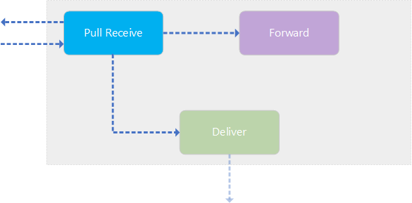

# Pull Receive Agent

The following section describes what the **Pull Receive Agent** is and what's its responsibility is:

## Agent Responsibility

The **Pull Receive Agent** is has the same responsibility as the (Push) **Receive Agent**: to receive `AS4Message`'s via the configured _Receiver_ from the sending MSH but instead of receiving directly the message the agent polls for an available message.

It's useful to use this type of agent if the the receiving MSH isn't always online, or as a limited bandwidth, ... Because the agent polls for available message on the sending MSH; the receiving-side takes control of when a new `AS4Message` arrives instead of waiting and constantly making sure there's an available connection endpoint to send messages to.

## Message Flow

The receival of `AS4Message`'s is identical to the (Push) **Receive Agent**, it's the triggering that's different not the receival.
See the message flow on the **Receive Agent** page to get the actual steps that happen during a **Receive Operation**.

## Agent Trigger

Because the agent itself is responsible for polling for `AS4Message`'s; the _Receiver_ is isn't actually "receiving" messages directly. Instead the **Pull Receive Agent** is made to use a _Exponential Backoff_ strategy which means that the longer it takes for a `AS4Message` to be available at the sending side, the longer the _Receiver_ will wait to poll for the next `AS4Message`.

> The minimum and maximum polling interval used in the _Exponential Backoff_ is configurable on the _Receiver_.

Each time the _Receiver_ triggers the polling, a _PullRequest_ is send to the sending MSH which will result in either an `UserMessage` or `Error` saying that there's no available `UserMessage`. When a `UserMessage` arrives at the receiving MSH, the same message flow as the (Push) **Receive Agent** will take place.
