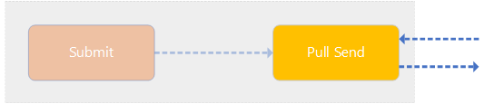

# Pull Send Agent

The following section describes what the **Pull Send Agent** is and what its responsibility is:



## Agent Responsibility

The **Pull Send Agent** has the responsibility to respond with `AS4Message`'s on received _PullRequest_'s. Just like the (Push) **Send Agent**, this agent will send out `AS4Message`'s but not by its own. It will wait for a _PullRequest_ to arrive to respond with the 'to-be-sent' `AS4Message`.

This agent works together with the **Pull Receive Agent** by which the **Pull Receive Agent** will send out _Pull Request_'s that the **Pull Send Agent** will respond to with either an available _UserMessage_ or an _Error_ indicating that there's no _UserMessage_ available.

## Message Flow

When an `AS4Message` gets submitted by the Business Application (message producer), the **Pull Send Agent** will wait for a _PullRequest_ that arrives that requests that _UserMessage_.

The selection of _UserMessage_'s will happen with the information that's found in the received _PullRequest_ which includes the _Message Partition Channel_ (MPC) and the _Message Exchange Pattern_ (MEP).

The **Pull Send Agent** will only respond with the selected _UserMessage_ if the signed _PullRequest_ is configured in the **Authorization Map** for the _UserMessage_. Otherwise the agent will respond with an _Error_ saying that the _PullRequest_ is not authorized to receive these kind of _UserMessage_'s

> If the _PullRequest_ isn't signed and no entries are present in the **Authorization Map**, the _PullRequest_ will be seen as an authorized _PullRequest_.

## Authorization Map

The **Authorization Map** is a file that's located at `.\config\Security\pull_authorizationmap.xml`. The file contains all the authorized _PullRequest_'s together with the certificate thumprint which should be the same as the thumprint used to sign the _PullRequest_.

The file has the following structure:

```xml
<?xml version="1.0" encoding="utf-8"?>
<PullRequestAuthorizationMap>
    <AuthorizationEntry mpc="my-pullrequest-mpc" certificatethumprint="my-certificate-thumprint" allowed="true" />
</PullRequestAuthorizationMap>
```
