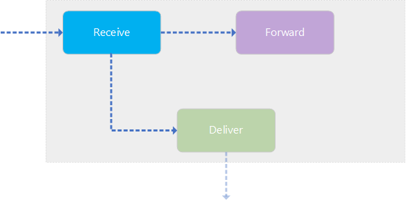

# Receive Agent

The following section describes what the **Receive Agent** is and what its responsibility is:

## Agent Responsibility

The **Receive Agent** is a "connection-point" to other MSH instances. This agent will receive `AS4Message`'s that's being sent form other MSH's.
During this receive operation, the incoming `AS4Message` will be verified if it has a valid signature, if the possible attachments are correctly encrypted, ... All these verification options (and others) can be configured with a _Receiving Processing Mode_ that's being determined during the receive operation.

## Message Flow

When an `AS4Message` gets received by the agent it goes through a series of steps:

1.  Determine the right _Receiving Processing Mode_ for the incoming message. This determination is based on a system that tries to match the incoming message with a **single** configured _Receiving Processing Mode_. By "matching", we mean that the information included in the message (from party, to party, service type, action ...) has the same values as the values configured in the pmode.

    > IMPORTANT: make sure that only a **single** _Receiving Processing Mode_ matches the incoming message, otherwise the determination will fail and the message will not be processed any further.

2.  When a _Receiving Processing Mode_ gets assigned to the message, the message itself will be validated. The validation consists of the following rules:

    - The SOAP body of the `AS4Message` should be empty
    - Each `ParttInfo` element should have an unique `href` reference to a embedded payload (`href` that starts with `'cid:'`)
    - Each included `Attachment` should reference a `PartInfo`

3.  After the validation, the included `Attachment`'s (if any) will be decrypted using the information found in the assigned _Receiving Processing Mode_. But only if the pmode allows it, this means that the `Decryption` option is set to either `Required` or `Allowed`. In the case of `Ignored` or `NotAllowed` the decryption will not take place or isn't allowed at all.
    When the decryption does happen, it uses the included information found in the pmode: certificate to decrypt, the algorithm to use, ...

4.  After the message is possibly decrypted, it verifies if the signature (if exists) is valid. But only if the pmode allows it, this means that the `Signature` option is set to either `Required` or `Allowed`. In the case of `Ignored` or `NotAllowed` the verification will not take place or isn't allowed at all.

    > Note: for incoming Non-Repudiation `Receip`'s, the _Receiving Processing Mode_ has an option (`VerifyNRR`) to also verify the included references.

5.  After the message has been verified, the included `Attachments`'s (if any) will be decompressed.

    > Note: if the incoming message must be forwarded, this step will not happen.

6.  Finally, when ever verification and unwrapping of the message has successfully completed, the component will create a `Receipt`. This `Receipt` will be signed if the _Receiving Processing Mode_ is configured this way (`Signing.IsEnabled` is set to `true`).
    This `Receipt` will then be responded to the sender.

7.  If any of the above described steps fail for any reason: not matched _Receiving Processing Mode_, decryption failure, signature invalid, ... an `Error` will be created that includes the failure message. This `Error` will be signed if the _Receiving Processing Mode_ is configured this way (`Signing.IsEnabled` is set to `true`).

## Agent Trigger

The **Receive** operation is triggered each time the configured _Receiver_ receives an `AS4Message`. This _Receiver_ will act as the "entry-point" of the agent. If no `AS4Message` is received, the **Receive** operation will be triggered but the agent will respond with an error saying an unexpected message is received.

## Static Receive Agent

The **Receive Agent** can be configured as a **Static Receive Agent**. This requires you to pre-configure the **Receive Agent** with a specifiec _Receiving Processing Mode_. A **Static Receive Agent** will only allow _UserMessages_ to be received, _SignalMessages_ will be rejected.
For each received `AS4Message`, the specified _Receiving Processing Mode_ will be used during the **Receive Operation** and no determination of a _Receiving Processing Mode_ will take place.

To configure a **Static Receive Agent**, do the following:

- Go to the configuration of the **Receive Agent** you want to make static.
- Make sure the **Transformer** is a `ReceiveMessageTransformer`
- The setting `ReceivingPMode` will be appear
- Specify the _Receiving Processing Mode_ by selecting one of the configured pmodes
