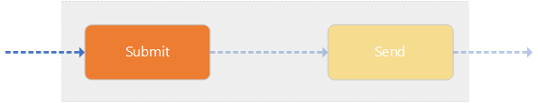

# Submit Agent

The following section describes what the **Submit Agent** is and what its responsibility is:

## Agent Responsibility

The **Submit Agent** acts as the "entry-point" of the component for when a message is to be sent. Its only task is to make sure that the `SubmitMessage` is transformed to an `AS4Message` using a _Sending Processing Mode_ so that the message can be send correctly by the **Send Agent** to the next MSH

## Message Flow

When a `SubmitMessage` gets sent to the agent, it goes to a flow to transform the message to a canonical `AS4Message` used in the rest of the component.

1.  Retrieve the right _Sending Processing Mode_ from the `SubmitMessage` used further in the <b>AS4.NET</b> Component
2.  Transform the incoming `SubmitMessage` to an `AS4Message` using both the information specified in the `SubmitMessage` and the determined _Sending Processing Mode_
3.  Send the `AS4Message` to the **Send Agent** so it can further be processed

## Agent Trigger

The **Submit** operation is triggered each time the Business Application (message producer) sends a `SubmitMessage` to the agent.
A `SubmitMessage` can be send to the **Submit Agent** via a its configured _Receiver_.

## Static Submit Configuration

The **Submit Agent** can be configured as a **Static Submit Agent**. This requires you to pre-configure the **Submit Agent** with a specific _Sending Processing Mode_. A **Static Submit Agent** requires you to submit payloads directly to the agent instead of using `SubmitMessage`'s. For every submitted payload, the pre-configured _Sending Processing Mode_ will be used to create an `AS4Message`.

To configure a **Static Submit Agent**, do the following:

- Go to the configuration of the **Submit Agent** you want to make static
- Change the **Transformer** to a `SubmitPayloadTransformer`
- The setting `SendingPMode` will be appear
- Specify the _Sending Processing Mode_ that must be used to create `AS4Message`'s for the files that are sent to the **Submit Agent**
