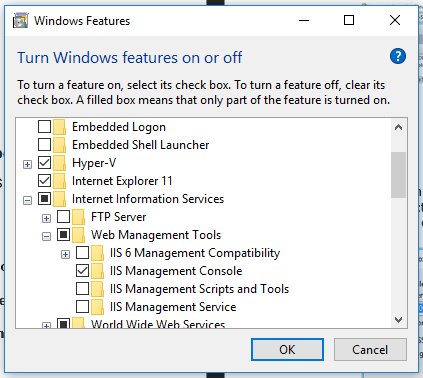
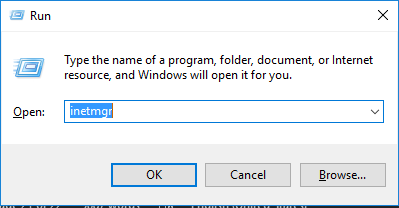
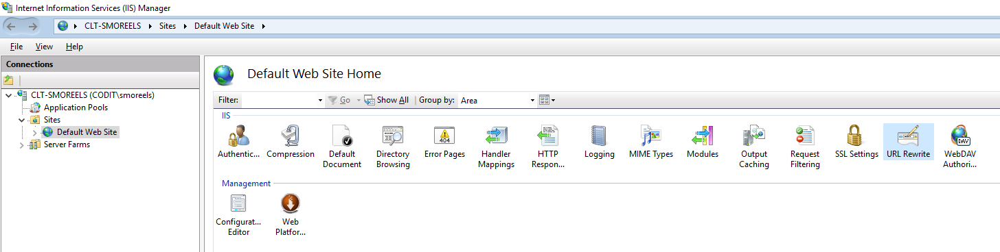
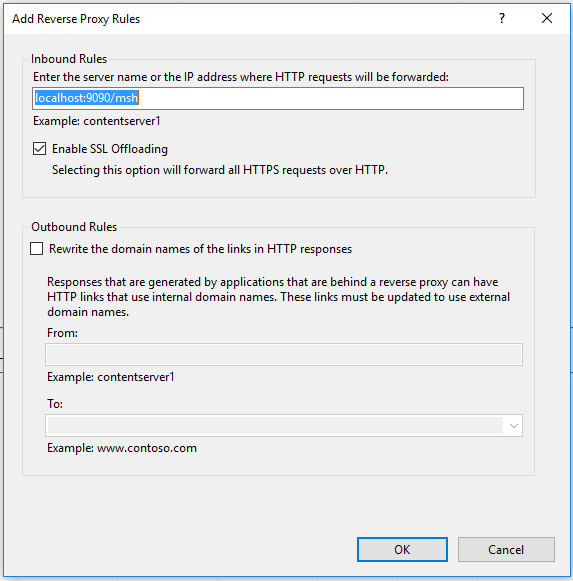
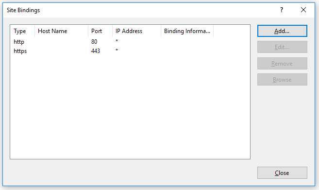
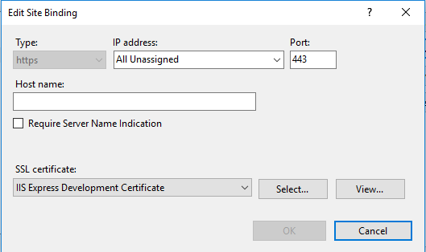
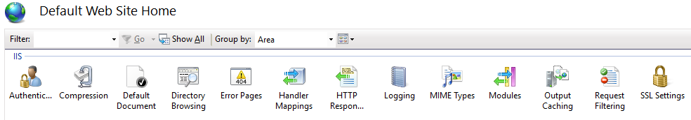

# Install/Configure Reverse Proxy for HTTPS Support with IIS

This procedure describes how to install/configure your receiving MSH for HTTPS support. In this procedure, we will use the Default Web Site as reverse proxy.

## Installing Application Request Routing Extension

We need to install this extension so we can configure the URL Rewrite in our reverse proxy.

- Go to https://www.iis.net/downloads/microsoft/application-request-routing
- Click on **Install this Extension**

## Activate ISS Manager

On a local machine, default the ISS Manager isn’t activated as Windows Component.

- Click **Start → Control Panel → Programs → Program and Features**
- On the left pane, click **Turn Windows features on or off**
- Expand **Internet Information Services** à **Web Management Tools**
- Check **IIS Management Console**

## Open IIS Manager

- Click **Start → Run**
- Type _inetmgr_ and click Open

## Rules

- In the left column **Connections**, Choose **Sites → Default Web Site**

- On the left pane **Actions**, click **Add rule(s)**
- Select **Reverse Proxy**
- Click **OK**

- Enter the IP of the **Receiving MSH** ([localhost:9090/msh]() in the example)
- Leave the **Outbound Rules** unchecked

- Use http://localhost:9090/{R:1} as **Rewrite URL**
- In the right pane **Actions**, click **Apply**

## Bindings

We need to specify in the bindings what’s the port number and certificate we use in the reverse proxy.

- In the left column **Connections**, Choose **Sites → Default Web Site**
- In the right pane **Actions**, click **Bindings**

- Click **Add**

- Select as **Type**: **https**
- Insert **443** as **Port**
- Select a **SLL Certificate** (IIS Express Development Certificate in example)

## SSL Settings

As extra, we configure the reverse proxy so it requires a certificate.

- In the left column **Connections**, Choose **Sites → Default Web Site**
- In the main view, click on **SLL Settings**

- Check the **Require SSL** checkbox
- Select the **Require** radio button

