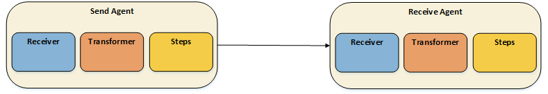

# Custom Connector

## Introduction

The implementation of AS4.NET can be expanded by writing custom connectors. This document explains how these custom connectors can be created to extend the AS4.NET component with some custom functionality (delivery of messages to other locations, retrieve payloads that must be sent from other locations, receive messages from custom sources, …).

### AS4.NET Components

The AS4.NET component consists of different Agents, each with a different responsibility: sending, receiving, forwarding, notifying, delivering, … Each Agent inside the AS4.NET component has three major items: **Receiver**, **Transformer**, and **Steps**. 



The **Receiver** is the first component inside an **Agent** that takes the initiative. It receives messages that the **Agent** can process. When a message is received by the **Receiver** it will first be transformed by a **Tranformer** before it goes through one or many **Steps**. The Transformer will make sure that the end result is a canonical-format message so we can reuse **Steps** across **Agents**. The **Steps** will adapt the message, update external sources, and finaly send the result to the target that needs the message; this can be another **Agent** or a external target.

### Custom Receiver

The AS4.NET component supports multiple sources on which it can receive or poll for messages: filesystem, HTTP, Datastore, … although for other types of sources you have to create a **Custom Receiver**.

We can define our own **Custom Receiver** for any agent we want. The **Receiver's** job is to listen or poll for messages at any source. These messages will be processed by the agent on which the receiver is configured. Each received message will be processed by the "*agent-pipeline*"; this includes the **Transformer** and the configured Steps of the agent. So if we create a batch-receiver to receive each time a couple of messages, each message will be handled separatly inside the agent.

Each **Receiver** must implement the `IReceiver` interface which looks like this.

```csharp
/// <summary>
/// Interface which holds the Signature of Receivers
/// </summary>
public interface IReceiver
{
    /// <summary>
    /// Configure the receiver with a given settings dictionary.
    /// </summary>
    /// <param name="settings">Settings to configure the <see cref="IReceiver"/> instance.</param>
    void Configure(IEnumerable<Setting> settings);

    /// <summary>
    /// Start receiving on a configured Target
    /// Received messages will be send to the given Callback
    /// </summary>
    /// <param name="messageCallback">Callback for each message that's being received.</param>
    /// <param name="cancellationToken">Cancel the <see cref="IReceiver"/> instance from receiving messages.</param>
    void StartReceiving(
        Func<ReceivedMessage, CancellationToken, Task<MessagingContext>> messageCallback,
        CancellationToken cancellationToken);

    /// <summary>
    /// Stop the <see cref="IReceiver"/> instance from receiving.
    /// </summary>
    void StopReceiving();
}   
```

Each **Receiver** will have the possibility to configure itself with **Settings**. This can include a path to poll for files, or a table in a database, or any other setting that is necessary for that specific Receiver.

When the AS4.NET component starts, the `StartReceiving` method will be called. One of the arguments that it sends with it, it is a `MessageCallback`. This callback is used to send received messages into the agent to which the receiver is configured.

When the agent stops, the `StopReceiving` method is called so the resources specific for the **Receiver** can be cleaned up.
Following example is a fictive example of a custom receiver that sends a message to the Agent on a specific interval.
  
```csharp
public class TimeReceiver : IReceiver
{
    private double _delay;

    public void Configure(IEnumerable<Setting> settings)
    {
        _delay = double.Parse(settings.First(s => s.Key == "Delay").Value);
    }

    public void StartReceiving(
        Func<ReceivedMessage, CancellationToken, Task<MessagingContext>> messageCallback,
        CancellationToken cancellationToken)
    {
        while (!cancellationToken.IsCancellationRequested)
        {
            messageCallback(new ReceivedMessage(Stream.Null), cancellationToken);
            Thread.Sleep(TimeSpan.FromMiliseconds(_delay));
        }
    }

    public void StopReceiving() { }
}
```

This `"Delay"` setting can be configured in the `settings.xml` file:

```xml
 <Receiver type="MyReceivers.TimeReceiver, MyReceivers, Version=1.0.0.0, Culture=neutral, PublicKeyToken=null">
    <Setting key="Delay">1000</Setting>
</Receiver>
```

#### Polling

Some receivers in the AS4.NET component are polling-based, these receivers can inherit from the `PollingTemplate`  (*Template Pattern*) to use the already defined functionality for polling. The `FileReceiver` and `DatastoreReceiver` in the AS4.NET component are **Polling Receivers**.

```csharp
public class CountReceiver : PollingTemplate<int, ReceivedMessage>, IReceiver
{
    protected override ILogger Logger => LogManager.GetCurrentClassLogger();
    protected override TimeSpan PollingInterval => TimeSpan.FromSeconds(1);

    public void Configure(IEnumerable<Setting> settings) { }

    public void StartReceiving(
        Func<ReceivedMessage, CancellationToken, Task<MessagingContext>> messageCallback,
        CancellationToken cancellationToken)
    {
        StartPolling(messageCallback, cancellationToken);
    }

    protected override IEnumerable<int> GetMessagesToPoll(CancellationToken cancellationToken)
    {
        return Enumerable.Range(0, 10);
    }

    ...
}
```

The `PollingTemplate` has some methods that must be overriden:

- `GetMessagesToPoll` defines a call to poll for messages. This can be on the file system, run a query to a database, call a SharePoint site, … any target to poll for messages

- `MessageReceived` is called for each message that has been retrieved. This method has the original callback which was given to the receiver by the `StartReceiving` method. In this method, the **Entity** must be transformed to a `ReceivedMessage` instance. and invoke the callback on it so it can be processed by the agent.

    

- `HandleMessageException` is called when an exception is thrown while handling the polled message (this exception is probably thrown somewhere in the agent and has been catched by the `PollingTemplate`).
 
- `ReleasePendingItems` defines a call that specifies what to do with remaining messages when the **Receiver** is canceled.

### Custom Delivery

When the received payloads must be delivered to a target that is not supported out of the box, a custom deliver implementation needs to be injected. Each deliverer implements the `IDeliverSender` interface:

```csharp
/// <summary>
/// Interface to describe where the <see cref="DeliverMessage"/> has to be send
/// </summary>
public interface IDeliverSender
{
    /// <summary>
    /// Start sending the <see cref="DeliverMessage"/>
    /// </summary>
    /// <param name="deliverMessage"></param>
    Task SendAsync(DeliverMessageEnvelope deliverMessage);

    /// <summary>
    /// Configure the <see cref="IDeliverSender"/>
    /// with a given <paramref name="method"/>
    /// </summary>
    /// <param name="method"></param>
    void Configure(Method method);
}
```

Each deliverer must be configured with a Method configuration. This is the configuration setting in the Receiving Pmode:

```xml
<PMode xmlns:xsi="http://www.w3.org/2001/XMLSchema-instance"
       xmlns:xsd="http://www.w3.org/2001/XMLSchema"
       xmlns="eu:edelivery:as4:pmode">
    <MessageHandling>
        <Deliver>
            <IsEnabled>true</IsEnabled>
            <PayloadReferenceMethod>
                <Type>SERVICEBUS-QUEUE</Type>
                <Parameters>
                    <Parameter name="ConnectionString" value="" />
                    <Parameter name="Queue" value="" />
                </Parameters>
            </PayloadReferenceMethod>
        </Deliver>
    </MessageHandling>
</PMode>
```
And for example, implement it as an Azure ServiceBus deliverer:

```csharp
public class ServiceBusSender : IDeliverSender, IDisposable
{
    private static readonly ILogger Logger = LogManager.GetCurrentClassLogger();

    private QueueClient _queue;

    public void Configure(Method method)
    {
        _queue = new QueueClient(
            method["ConnectionString"].Value,
            method["Queue"].Value);
    }

    public async Task SendAsync(DeliverMessageEnvelope envelope)
    {
        var msg = new Message(envelope.DeliverMessage) 
        {
            MessageId = envelope.MessageInfo.MessageId
        };

        await _queue.SendAsync(msg);

        Logger.Info($"[{envelope.MessageInfo.MessageId}] Send Deliver Message to Service Bus");
    }

    public void Dispose()
    {
        _queue.CloseAsync().Wait();
    }
}
```

The `DeliverMessageEnvelope` contains the "to-be-delivered" content. It contains the original message Id and a byte array of the actual delivermessage.

#### Registration

Now, you may have noticed that the configuration section also contains a **Type**. In our example, this was `"SERVICEBUS-QUEUE"`. Each custom deliverer must be configured in the `Registry`.

```xml
<PMode xmlns:xsi="http://www.w3.org/2001/XMLSchema-instance"
       xmlns:xsd="http://www.w3.org/2001/XMLSchema"
       xmlns="eu:edelivery:as4:pmode">
    <MessageHandling>
        <Deliver>
            <IsEnabled>true</IsEnabled>
            <DeliverMethod>
                <Type>SERVICEBUS-QUEUE</Type>
                <Parameters>
                    <Parameter name="ConnectionString" value="" />
                    <Parameter name="Queue" value="" />
                </Parameters>
            </DeliverMethod>
        </Deliver>
    </MessageHandling>
</PMode>
```

So, our custom deliver implementation could be registered like this:

```csharp
Registry.Instance.DeliverSenderProvider.Accept(
    condition: type => type == "SERVICEBUS-QUEUE",
    sender: () => new ServiceBusSender());
```

This way, the `ServiceBusSender` type can be used by the AS4.NET component.

### Uploading Payloads to a Custom Location

When a message must be delivered, it can contain payloads. The AS4.NET component can deliver payloads to some predefined locations (filesystem, payloadservice) and can be extended to upload payloads to custom locations.
 Each uploader must implement following interface:

 ```csharp
/// <summary>
/// Interface to upload Payloads to a given Media
/// </summary>
public interface IAttachmentUploader
{
    /// <summary>
    /// Configure the <see cref="IAttachmentUploader"/>
    /// with a given <paramref name="payloadReferenceMethod"/>
    /// </summary>
    /// <param name="payloadReferenceMethod"></param>
    void Configure(Method payloadReferenceMethod);

    /// <summary>
    /// Start uploading the <paramref name="attachment"/>
    /// </summary>
    /// <remarks>The <paramref name="referringUserMessage"/> parameter can be used
    /// by the IAttachmentUploader implementation when determining the name that must be
    /// given to the uploaded payload.</remarks>
    /// <param name="attachment">The <see cref="Attachment"/> that must be uploaded</param>
    /// <param name="referringUserMessage">The UserMessage to which the Attachment belongs to.</param>
    /// <returns>An UploadResult instance</returns>
    Task<UploadResult> UploadAsync(Attachment attachment, UserMessage referringUserMessage);
}
 ```

Since the **Deliver Message** references the location of the uploaded payloads, the uploader returns an **Upload Result**. This contains a reference and an id that can be included in the **Deliver Message**.

Each uploader can be configured with settings that can be found in the **Receiving PMode**:

```xml
<PMode xmlns:xsi="http://www.w3.org/2001/XMLSchema-instance"
       xmlns:xsd="http://www.w3.org/2001/XMLSchema"
       xmlns="eu:edelivery:as4:pmode">
    <MessageHandling>
        <Deliver>
            <IsEnabled>true</IsEnabled>
            <PayloadReferenceMethod>
                <Type>BLOB</Type>
                <Parameters>
                    <Parameter name="ConnectionString" value="" />
                    <Parameter name="Container" value="" />
                </Parameters>
            </PayloadReferenceMethod>
        </Deliver>
    </MessageHandling>
</PMode>
```

If payloads have to be uploaded to **Azure Blob Storage**, an `IAttachmentUploader` can be implemented that looks like this:

```csharp
public class BlobAttachmentUploader : IAttachmentUploader
{
    private CloudBlobContainer _container;

    public void Configure(Method payloadReferenceMethod)
    {
        CloudStorageAccount storageAccount = CloudStorageAccount.Parse(
            payloadReferenceMethod["ConnectionString"].Value);

        CloudBlobClient client = storageAccount.CreateCloudBlobClient();
        _container = client.GetContainerReference(payloadReferenceMethod["Container"].Value);;
        _container.CreateIfNotExists();
    }

    public async Task<UploadResult> UploadAsync(
        Attachment attachment, 
        UserMessage referringUserMessage)
    {
        CloudBlockBlob blob = _container.GetBlockBlobReference(attachment.Id);
        await blob.UploadFromStreamAsync(attachment.Content);

        return new UploadResult 
        {
            DownloadUrl = blob.Uri.AbsolutePath,
            PayloadId = blob.Name
        };
    }
}
```

#### Registration

To make sure that the AS4.NET component understands how to upload attachments to **Blob Storage**, we must register the custom `IAttachmentUploader` type in the `Registry`.

```csharp
Registry.Instance.AttachmentUploader.Accept(
    condition: s => s == "BLOB",
    uploader: new BlobAttachmentUploader());
```

This `"BLOB"` string will correspond with the Type configured in the **Receiving PMode**.

```xml
<PMode xmlns:xsi="http://www.w3.org/2001/XMLSchema-instance"
       xmlns:xsd="http://www.w3.org/2001/XMLSchema"
       xmlns="eu:edelivery:as4:pmode">
    <MessageHandling>
        <Deliver>
            <IsEnabled>true</IsEnabled>
            <PayloadReferenceMethod>
                <Type>BLOB</Type>
                <Parameters>
                    <Parameter name="ConnectionString" value="" />
                    <Parameter name="Container" value="" />
                </Parameters>
            </PayloadReferenceMethod>
        </Deliver>
    </MessageHandling>
</PMode>
```

### Custom Payload Retrieval

Inside a **Submit Message**, a reference to a Payload can be included. This payload can be located on the file system, can be on a remote server, … In order that the AS4.NET component knows where to look for, it has registered some **Payload Retrievers**.

```xml
<SubmitMessage>
    <Payloads>
        <Id>photo</Id>
        <MimeType>image/jpeg</MimeType>
        <Location>>https://accountname.blob.core.windows.net/photo.jpg</Location>
    </Payloads>
</SubmitMessage>
```

Each retriever is responsible for retrieving a payload from a certain source.  Custom retrievers can be made for a source 
Here’s the interface that must be implemented:

```csharp
/// <summary>
/// Interface that defines how a payload must be retrieved from a certain location.
/// </summary>
public interface IPayloadRetriever
{
    /// <summary>
    /// Retrieve <see cref="Stream"/> contents from a given <paramref name="location"/>.
    /// </summary>
    /// <param name="location">The location.</param>
    /// <returns></returns>
    Task<Stream> RetrievePayloadAsync(string location);
}
```

To implement a retriever that gets payloads from **Azure Blob Storage**, we could write something like this:
 
```csharp
public class BlobPayloadRetriever : IPayloadRetriever
{
    private readonly CloudBlobContainer _container;

    public BlobPayloadRetriever()
    {
        CloudStorageAccount storageAccount = CloudStorageAccount.Parse(
            payloadReferenceMethod["ConnectionString"].Value);

        CloudBlobClient client = storageAccount.CreateCloudBlobClient();
        _container = client.GetContainerReference("Payloads");
        _container.CreateIfNotExists();
    }

    public async Task<Stream> RetrievePayloadAsync(string location)
    {
        CloudBlob blob = _container.GetBlobReference(location);

        var str = new VirtualStream(VirtualStream.MemoryFlag.AutoOverflowToDisk);
        await blob.DownloadToStreamAsync(str);

        return str;
    }
}
```

#### Registration

Some retrievers are already registered: AS4.NET has `IPayloadRetriever` instances registered that can retrieve files from the filesystem and from a web location. Custom retrievers must be registered inside the `Registry` instance.

```csharp
Registry.Instance.PayloadRetrieverProvider.Accept(
    condition: p => p.Location.Contains("blob"),
    retriever: new BlobPayloadRetriever());
```

The location were the payload can be found, is available in the **Submit/Deliver Message**:

```xml
<SubmitMessage>
    <Payloads>
        <Id>my-photo</Id>
        <MimeType>image/jpeg</MimeType>
        <Location>>blob::///https://accountname.blob.core.windows.net/myphoto.jpg</Location>
    </Payloads>
</SubmitMessage>
```