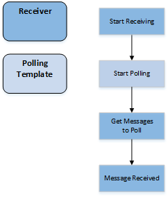

# Custom Receiver

The <b>AS4.NET</b> component supports multiple sources on which it can receive or poll for messages: filesystem, HTTP, Datastore, … although for other types of sources you have to create a **Custom Receiver**.

We can define our own **Custom Receiver** for any agent we want. The **Receiver's** job is to listen or poll for messages at any source. These messages will be processed by the agent on which the receiver is configured. Each received message will be processed by the "_agent-pipeline_"; this includes the **Transformer** and the configured Steps of the agent. So if we create a batch-receiver to receive each time a couple of messages, each message will be handled separatly inside the agent.

Each **Receiver** must implement the `IReceiver` interface which looks like this.

```csharp
/// <summary>
/// Interface which holds the Signature of Receivers
/// </summary>
public interface IReceiver
{
    /// <summary>
    /// Configure the receiver with a given settings dictionary.
    /// </summary>
    /// <param name="settings">Settings to configure the <see cref="IReceiver"/> instance.</param>
    void Configure(IEnumerable<Setting> settings);

    /// <summary>
    /// Start receiving on a configured Target
    /// Received messages will be send to the given Callback
    /// </summary>
    /// <param name="messageCallback">Callback for each message that's being received.</param>
    /// <param name="cancellationToken">Cancel the <see cref="IReceiver"/> instance from receiving messages.</param>
    void StartReceiving(
        Func<ReceivedMessage, CancellationToken, Task<MessagingContext>> messageCallback,
        CancellationToken cancellationToken);

    /// <summary>
    /// Stop the <see cref="IReceiver"/> instance from receiving.
    /// </summary>
    void StopReceiving();
}
```

Each **Receiver** will have the possibility to configure itself with **Settings**. This can include a path to poll for files, or a table in a database, or any other setting that is necessary for that specific Receiver.

When the <b>AS4.NET</b> component starts, the `StartReceiving` method will be called. One of the arguments that it sends with it, it is a `MessageCallback`. This callback is used to send received messages into the agent to which the receiver is configured.

When the agent stops, the `StopReceiving` method is called so the resources specific for the **Receiver** can be cleaned up.
Following example is a fictive example of a custom receiver that sends a message to the Agent on a specific interval.

```csharp
public class TimeReceiver : IReceiver
{
    private double _delay;

    public void Configure(IEnumerable<Setting> settings)
    {
        _delay = double.Parse(settings.First(s => s.Key == "Delay").Value);
    }

    public void StartReceiving(
        Func<ReceivedMessage, CancellationToken, Task<MessagingContext>> messageCallback,
        CancellationToken cancellationToken)
    {
        while (!cancellationToken.IsCancellationRequested)
        {
            messageCallback(new ReceivedMessage(Stream.Null), cancellationToken);
            Thread.Sleep(TimeSpan.FromMiliseconds(_delay));
        }
    }

    public void StopReceiving() { }
}
```

This `"Delay"` setting can be configured in the `settings.xml` file:

```xml
 <Receiver type="MyReceivers.TimeReceiver, MyReceivers, Version=1.0.0.0, Culture=neutral, PublicKeyToken=null">
    <Setting key="Delay">1000</Setting>
</Receiver>
```

#### Polling

Some receivers in the <b>AS4.NET</b> component are polling-based, these receivers can inherit from the `PollingTemplate` (_Template Pattern_) to use the already defined functionality for polling. The `FileReceiver` and `DatastoreReceiver` in the <b>AS4.NET</b> component are **Polling Receivers**.

```csharp
public class CountReceiver : PollingTemplate<int, ReceivedMessage>, IReceiver
{
    protected override ILogger Logger => LogManager.GetCurrentClassLogger();
    protected override TimeSpan PollingInterval => TimeSpan.FromSeconds(1);

    public void Configure(IEnumerable<Setting> settings) { }

    public void StartReceiving(
        Func<ReceivedMessage, CancellationToken, Task<MessagingContext>> messageCallback,
        CancellationToken cancellationToken)
    {
        StartPolling(messageCallback, cancellationToken);
    }

    protected override IEnumerable<int> GetMessagesToPoll(CancellationToken cancellationToken)
    {
        return Enumerable.Range(0, 10);
    }

    ...
}
```

The `PollingTemplate` has some methods that must be overriden:

- `GetMessagesToPoll` defines a call to poll for messages. This can be on the file system, run a query to a database, call a SharePoint site, … any target to poll for messages

- `MessageReceived` is called for each message that has been retrieved. This method has the original callback which was given to the receiver by the `StartReceiving` method. In this method, the **Entity** must be transformed to a `ReceivedMessage` instance. and invoke the callback on it so it can be processed by the agent.

  

- `HandleMessageException` is called when an exception is thrown while handling the polled message (this exception is probably thrown somewhere in the agent and has been catched by the `PollingTemplate`).

- `ReleasePendingItems` defines a call that specifies what to do with remaining messages when the **Receiver** is canceled.
