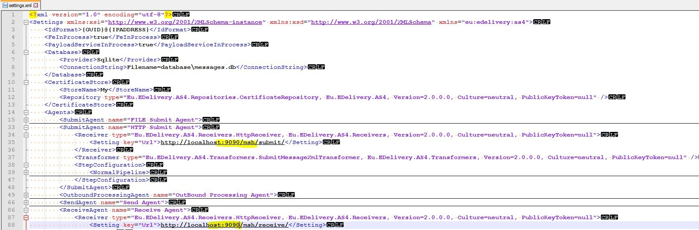
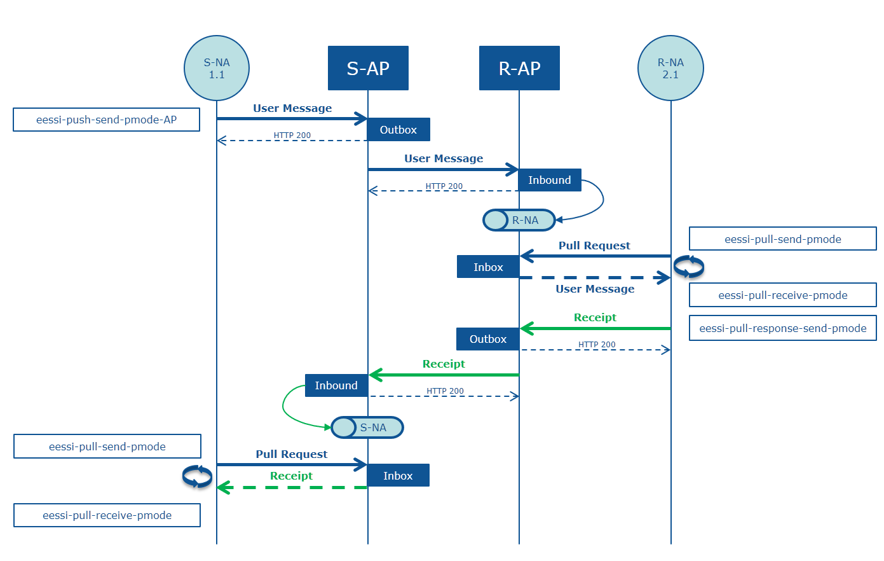

# Sample Scenarios

Now the basics are explained, we can now start with the preparation of the samples. The following prerequisites need to be performed before the samples can be executed. Remark that the AS4.NET
component can solely run on a Windows machine.

## Create Two Instances of the MSH

To send/receive messages from two different MSH’s you can use your own MSH configuration or just copy the root folder to another name:

**AS4 .NET Sender** (acts as Access Point A)
**AS4 .NET Receiver** (acts as Access Point B)

## Change the HTTP Port of the Receiver Instance

The two instances both have a `ReceiveAgent` configured that uses a `HttpReceiver`. When both the **Sending** and the **Receiving** instance runs on the same machine, it is logical they cannot share the same HTTP endpoint. Therefore, the HTTP endpoint of one of the two AS4.NET instances must be modified.
The samples that are present in the package assume that the Receiver instance listens on port 9090 and the Sender listens on port 8081.

Therefore, modify the HTTP receiver in the `.\config\settings.xml` of the **AS4.NET Receiver** so that port 9090 is used.

Note that there are two agents defined in the settings.xml file that use a HttpReceiver:

* Change the address of the submitagent to http://localhost:9090/msh/submit/
* Change the address of the receiveagent to http://localhost:9090/msh/receive/



## Copy the required sample PModes

On the sending instance, copy the following PModes from the samples folder to the `AS4 .NET Sender\config\send-pmodes` folder:

* `samples\pmodes\01-sample-send-pmode.xml`
* `samples\pmodes\02-sample-send-pmode.xml`
* `samples\pmodes\03-sample-send-pmode.xml`

On the receiving instance, copy the following PModes from the samples folder to the `AS4 .NET Receiver\config\receive-pmodes` folder:

* `samples\pmodes\01-sample-receive-pmode.xml`
* `samples\pmodes\02-sample-receive-pmode.xml`
* `samples\pmodes\03-sample-receive-pmode.xml`

On the receiving instance, copy the following PModes from the samples folder to the `AS4 .NET Receiver\config\send-pmodes` folder:

* `samples\pmodes\signed-reponse-pmode.xml`
* `samples\pmodes\unsigned-reponse-pmode.xml`

## Install the Required Certificates

Import the following private certificates in **Certificates (Local Computer) / Personal / Certificates**:

* `samples\certificates\AccessPointA.pfx`
* `samples\certificates\AccessPointB.pfx`

Don't forget to mark these certificates as **exportable**. This is required since AS4.NET needs access to the private key for signing and decryption.

Import the following public certificates in **Certificates (Local Computer) / Trusted Root Certification Authorities / Certificates**:

* `samples\certificates\AccessPointA.cer`
* `samples\certificates\AccessPointB.cer`

For instructions on how to Import the certificates files see the section: <u>Install Certificates</u>.

## Start the Two MSH Instances

Start both instances by right clicking on `Eu.EDelivery.AS4.ServiceHandler.ConsoleHost.exe` and choosing _Run as Administrator_.


When starting the 2nd instance you will get an error message saying that port 3000 and 5000 are already in use.


These ports are used to run the _AS4.NET Portal_ and the _PayloadService_.
For this sample scenario you can ignore this error as it will have no impact. To avoid this error you can disable the AS4.NET Portal and PayloadService in the `settings.xml` file by changing the `FeInProcess` and `PayloadServiceInProcess` tags to `false`.


You can also change the AS4.NET Portal and PayloadService ports of either the receive or send instance, this configuration is done in the **AS4 .NET Receiver** (or **Sender**)`\bin\appsettings.inprocess.json` file.

## Sending Simple AS4 Message

The first example consists of a AS4 message with a single payload that is being sent from one AS4 .NET Instance to another. This example is the simplest form of sending a message, <u>it contains no compression, signing or encryption</u>.

Go to `AS4 .NET Sender\samples\messages` folder and copy the `01-sample-message.xml` to the configured `AS4 .NET Sender in the messages\out` folder.

When the two instances are running, the message will now be sent to the configured AS4 .NET Receiver and will be stored in the `messages\in` folder of this instance together with the attachment that was being send with it.

The sending/receiving PModes in this example are configured to notify/deliver the **Business Application** through the file system. Any Receipts received are notified in the `messages\receipts` folder, any Errors received are notified in the `messages\errors` folder and any Exceptions generated are notified in the `messages\exceptions` folder.

## Sending Signed AS4 Message

The second example consists of a AS4 Message with multiple payloads that’s being send from one AS4 .NET Instance to another. This example uses compression and signing of the message and will return a normal receipt to the configured AS4 .NET Sender.

Go to `AS4 .NET Sender\samples\messages` folder and copy the `02-sample-message.xml` to the configured AS4 .NET Sender in the `messages\out` folder.

When the two instances are running, the message will now be sent to the configured **AS4 .NET Receiver** and will be stored in the `messages\in` folder of this instance together with the attachment that was being send with it.

The sending/receiving PModes in this example are configured to notify/deliver the “**usiness Application** through the file system. Any Receipts received are notified in the `messages\receipts` folder, any Errors received are notified in the `messages\errors` folder and any Exceptions generated are notified in the `messages\exceptions` folder.

## Sending Signed & Encrypted AS4 Message

The third example consists of a AS4 Message with multiple payloads that’s being send from one AS4 .NET Instance to another. This example uses compression, signing and encryption of the message and will return a **NRR (Non-Repudiation Receipt)** to the configured AS4 .NET Sender.

Go to `AS4 .NET Sender\samples\messages` folder and copy the `03-sample-message.xml` to the configured AS4 .NET Sender in the `messages\out` folder.

When the two instances are running, the message will now be send to the configured AS4 .NET Receiver and will be stored in the `messages\in` folder of this instance together with the attachment that was being send with it.

The sending/receiving PModes in this example are configured to notify/deliver the **Business Application** through the file system. Any Receipts received are notified in the `messages\receipts` folder, any Errors received are notified in the `messages\errors` folder and any Exceptions generated are notified in the `messages\exceptions` folder.

## Pulling as a Receiver as an ebMS endpoint in EESSI

The AS4.NET Component can act as an ebMS endpoint in the EESSI profile and can receive AS4 Messages via Pulling.

To configure an AS4.NET MessageHandler to act as an ebMS endpoint that receives AS4 Messages from EESSI the following PModes are required:



* A Sending PMode which is used to send AS4 Messages via MultiHop in the _Push Message Exchange Pattern_. (`eessi-push-send-pmode-AP`)
* A Sending PMode that is used by a PullReceive Agent. The PullReceive Agent uses this PMode to send PullRequest signal-messages. (`eessi-pull-send-pmode`)
* A Receiving PMode that is used by the PullReceive Agent. When an AS4 Message is received via Pulling, the PullReceive Agent will dynamically determine the Receiving PMode that is necessary to treat the received AS4 Message. (`eessi-pull-receive-pmode`)
* A Sending PMode that is used to send a Receipt or Error signal-message. (`eessi-pull-response-send-pmode`)

To setup an EESSI ebMS endpoint, the following steps need to be undertaken:

### Configure the PModes

In the `samples\pmodes\eessi` folder, you can find skeleton files for the PModes that were mentioned in the previous section.
You’ll need to make some minor modifications to those files in order to be able to use them within EESSI:

#### `eessi-push-send-pmode.xml`

* Configure the URL to where AS4 Messages should be pushed (outbox)
* Specify the TLS certificate that must be used
* Specify the Signing certificate that must be used
* Specify the PartyInfo

#### `eessi-pull-send-pmode.xml`

* Specify the MPC that is used for pulling
* Configure the URL to where PullRequest signals must be send (inbox)
* Specify the TLS certificate that must be used
* Specify the Signing certificate that must be used

#### `eessi-pull-receive-pmode.xml`

No mandatory configuration modifications are required.

#### `eessi-pull-response-send-pmode.xml`

* Configure the URL to where Receipt / Error signals must be send (outbox)
* Specify the TLS certificate that must be used
* Specify the Signing certificate that must be used

Copy the `eessi-pull-receive-pmode.xml` file to `config\receive-pmodes` folder.

Copy the following files to the `config\sending-pmodes` folder:

* `eessi-push-send-pmode.xml`
* `eessi-pull-send-pmode.xml`
* `eessi-pull-response-pmode.xml`

### Modify `settings.xml` to Enable a PullReceive Agent

The `settings.xml` file has a PullReceive Agent configured that is currently commented out.

In the configuration of that **PullReceive Agent** you’ll see that the eessi-pull-send-pmode is used to send PullRequest signal-messages. The PullReceive Agent will send PullRequest messages in intervals that vary from 1 second to 25 seconds, depending on the response that is received for the PullRequest. When no messages are received as a result of a PullRequest, the interval will gradually increase until a maximum interval of 25 seconds is reached. When messages are received, the interval will be reset to the configured minimum-interval.

Remove the comments and start the AS4.NET component. You’ll see that the AS4.NET MSH will start sending PullRequest signal-messages to the URL that has been configured in the `eessi-pull-send-pmode`.

## Modify `settings.xml` to Enable a Static Submit Agent

The `settings.xml` file already has a **Submit Agent** configured; using the `FileReceiver` and the `SubmitXmlTransformer`. This wil result in an agent that transforms a submit message from an `.xml` file.
When we change the **Transformer** type from `SubmitXmlTransformer` to `SubmitPayloadTransformer`; we can transform directly payloads into a `SubmitMessage` (using a default _Sending Processing Mode_).

Example:

```xml
<SubmitAgent name="Static Submit Agent">
    <Receiver type="Eu.EDelivery.AS4.Receivers.FileReceiver, Eu.EDelivery.AS4.Receivers, Version=1.0.0.0, Culture=neutral, PublicKeyToken=null">
        <Setting key="FilePath">.\messages\out</Setting>
        <Setting key="FileMask">*.xml</Setting>
        <Setting key="PollingInterval">0:00:05</Setting>
    </Receiver>
    <Transformer type="Eu.EDelivery.AS4.Transformers.SubmitPayloadTransformer, Eu.EDelivery.AS4.Transformers, Version=1.0.0.0, Culture=neutral, PublicKeyToken=null">
        <Setting key="SendingPMode">my-default-pmode</Setting>
    </Transformer>
    <StepConfiguration>
        <NormalPipeline>
            <Step type="Eu.EDelivery.AS4.Steps.Submit.RetrieveSendingPModeStep, Eu.EDelivery.AS4.Steps, Version=1.0.0.0, Culture=neutral, PublicKeyToken=null"/>
            <Step type="Eu.EDelivery.AS4.Steps.Submit.CreateAS4MessageStep, Eu.EDelivery.AS4.Steps, Version=1.0.0.0, Culture=neutral, PublicKeyToken=null"/>
            <Step type="Eu.EDelivery.AS4.Steps.Submit.StoreAS4MessageStep, Eu.EDelivery.AS4.Steps, Version=1.0.0.0, Culture=neutral, PublicKeyToken=null" />
        </NormalPipeline>
    </StepConfiguration>
</SubmitAgent>
```
