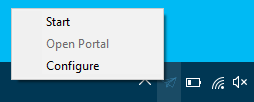
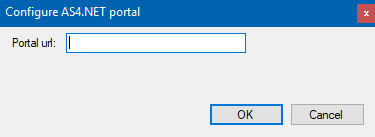

# Windows Service Installation

The AS4.NET component can also be installed as a Windows Service. The installation of the service is packaged into a MSI file located at `.\service-setup\Eu.EDelivery.AS4.WindowsService.Installer.msi`.

## Install Procedure of the Windows Service

When starting the procedure by clicking on the file, the startup view is shown:

Click **Next** to continue.

The next screen lets you decide where the Windows Service should be installed and which users should be able to control the service.

After you configured this, click **Next** to continue.

The last screen will tell you that you're about to install the service.

Click **Next** to begin the installation.

## Running Windows Service

When the Windows Service is installed; you should see a system tray icon in your task bar meaning that the service is installed:

By right-clicking on the icon you can control the installed service:

With this simple menu, you can start/stop the service and open the portal to configure the MSH itself.

- **Start**: start the Windws Service
- **Open Portal**: opens to portal on the configured url
- **Configure**: configures the portal url

When you click on the **Configure** menu item, a sub-window is shown where you can fill in the location where the portal is hosted.

> This is by default on `http://localhost:5000` but can be different if you change the `appsettings*.json` files which are located at the installation folder.

